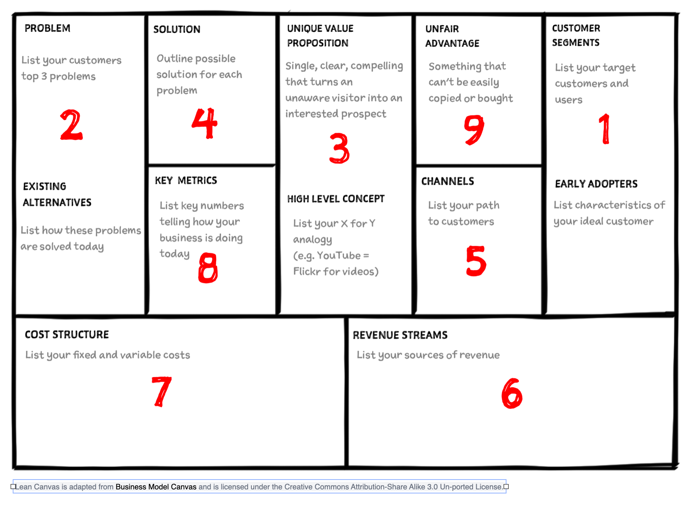

# 🎯 LEAN CANVAS — YOURFOCUS v3.0

> **Sistema de Prótesis Cognitiva para el Enfoque Profundo**
>
> _Versión:_ 3.0 (Arquitectura Híbrida & Soberanía Financiera)  
> _Última actualización:_ 2026-02-07

---

## 📋 RESUMEN VISUAL




---

## 1️⃣ PROBLEMA

hiper informacion de la industria de los profesionales del conocimiento, desgaste/fatiga por desicion y analisis critico y sistematico de la informacion.
friccion y difuminacion en las herramientas de registro y gestion.
falta de interoperatibilidad entre herramientas.
disfuncion ejecutiva y paralisis por analisis en personas neurodivergentes y con fatiga cronica.

### Problemas Top 3 del usuario objetivo:

| #   | Problema                                                                                           | Impacto |
| --- | -------------------------------------------------------------------------------------------------- | ------- |
| 1   | **Sobrecarga cognitiva** — El monólogo interno no se externaliza, causando parálisis y ansiedad    | Alto    |
| 2   | **Brecha ejecución-idea** — Las ideas se quedan en la cabeza sin convertirse en tareas accionables | Alto    |
| 3   | **Fragmentación de herramientas** — Usar múltiples apps (notas, tareas, timers) diluye el enfoque  | Medio   |

### Alternativas existentes actuales:

- Notion + Toggl + Journaling manual
- Apps de Pomodoro genéricas (sin contexto)
- Grabadoras de voz + transcripción manual

---

## 2️⃣ SEGMENTO DE CLIENTES

### Early Adopters (Foco inicial):

| Perfil                           | Características                             | Pain Point Principal                       |
| -------------------------------- | ------------------------------------------- | ------------------------------------------ |
| **Desarrolladores autodidactas** | Aprenden solos, trabajan remoto, LATAM      | Mantener disciplina sin estructura externa |
| **Profesionales en transición**  | Cambiando de carrera, estudiando ingeniería | Necesitan demostrar cómo piensan           |
| **Founders técnicos**            | Proyectos personales, recursos limitados    | Maximizar output con tiempo fragmentado    |

### Total Addressable Market / Serviceable Addressable Market / Serviceable Obtainable Market

- **TAM:** Mercado global de productividad personal (~$102B)
- **SAM:** Desarrolladores + profesionales tech LATAM (~$500M)
- **SOM:** 250-1,000 usuarios pagos (Año 1: $2k-$10k MRR)

---

## 3️⃣ PROPUESTA DE VALOR ÚNICA (UVP)

> ### 💡 **"kaizen based active knowledge management"**
>
> ### 💡 **"Transforma tu monólogo interno en sistemas de ejecución"**

**Fórmula High-Level:**

```
[Bitácora de Voz] + [IA Estructuradora] + [Pomodoro Integrado] = [Tareas + OKRs + Timeline Automático]
```

### Diferenciadores clave:

1. **Externalización del pensamiento** — No es journaling, es operacionalización (Rubber Ducking)
2. **Contexto persistente** — La IA conoce tu Zettelkasten personal y puede ayudarte a conectar ideas y tareas.
3. **Métricas de rendimiento cognitivo** — Pomodoros como KPI de salud mental y productividad.
4. **Active recall & spaced repetition** — Sistema de notificaciones personalizadas para mejorar la retención de información.

---

## 4️⃣ SOLUCIÓN

### Features MVP (Core):

| Feature                     | Descripción                                 | Estado          |
| --------------------------- | ------------------------------------------- | --------------- |
| **Bitácoras de voz**        | Grabación y transcripción con Whisper       | ✅ Implementado |
| **Estructuración IA**       | Extracción de tareas, OKRs, insights        | ✅ Implementado |
| **Pomodoro integrado**      | Timer con estados: Focus, Break, Long Break | ✅ Implementado |
| **Sistema de Tags**         | Organización y filtrado de tareas           | ✅ Implementado |
| **Milestones compartibles** | Links de prueba de trabajo                  | 🔄 En progreso  |
| **Reminders**               | active recall & spaced repetition           | 🔄 En progreso  |

### Arquitectura Técnica (Pipeline "Malacate"):

```
[Audio PWA] → [Whisper WASM/Server] → [Texto] → [Gemini Flash] → [JSON Estructurado] → [Supabase]
```

---

## 5️⃣ CANALES

### Canales de Adquisición:

| Canal                               | Tipo              | CAC Esperado |
| ----------------------------------- | ----------------- | ------------ |
| **Milestones compartibles**         | Orgánico/Viral    | ~$0          |
| **Comunidades de desarrolladores**  | Orgánico          | ~$0          |
| **Linkedin/tiktok/referidos**       | Orgánico          | ~$0          |
| **Contenido técnico (blog/videos)** | Content Marketing | ~$5-10       |

### Canales de Distribución:

- **PWA Web** (primario)
- **Extensión browser** (futuro)

---

## 6️⃣ FLUJOS DE INGRESOS

### Modelo de Pricing:

| Plan           | Precio       | Features                                                                             |
| -------------- | ------------ | ------------------------------------------------------------------------------------ |
| **Básico**     | $12 USD/mes  | características básicas y limitadas para cumplir objetivos de negocio                |
| **Tech**       | $15 USD/mes  | usuarios avanzados con su propia key de IA                                           |
| **Pro**        | $20 USD/mes  | Bitácoras mas largas, características avanzadas gracias a un mejor marjen financiero |
| **Anual tech** | $52 USD/año  | mayor fidelidad, engagement y descuento                                              |
| **Anual pro**  | $129 USD/año | mayor fidelidad, engagement y descuento                                              |

### Unit Economics (Target):

| Métrica                | Valor                        |
| ---------------------- | ---------------------------- |
| Precio promedio        | ($15.6 + $90.5) / 2 = $53.05 |
| COGS por usuario       | < 45% (Incluye IA + Fees)    |
| **Margen bruto**       | **> 55%**                    |
| Usuarios para $400 MRR | < 50                         |

---

## 7️⃣ ESTRUCTURA DE COSTOS

### Costos Variables (por usuario):

| Concepto       | Estimado/mes               |
| -------------- | -------------------------- |
| IA Multimodal  | ($1.78 - $2.50) < $5       |
| Comisiones MoR | 5% + $0.50                 |
| Comisiones P2P | 6.5% \ (5.3% +$0.8) \ 3-4% |
| **COGS Total** | **$5 < $10**               |

### Costos Fijos:

| Concepto         | Estimado/mes         |
| ---------------- | -------------------- |
| Supabase (infra) | ~$25 - $50/mes       |
| Dominio/hosting  | ~$3.75/mes - $45/año |
| Herramientas dev | ~$0.00 - $19.99/mes  |
| **Costos Fijos** | **$28.75 < $55**     |

### Stack de Tesorería (Venezuela-specific):

- **Recaudación:** Lemon Squeezy (MoR)
- **Offshore:** Facebank International (Puerto Rico)
- **Liquidez local:** Meru (minoritario) / Binance P2P (mayoritario)
- **Efectivo USD:** Meru / MoneyGram

---

## 8️⃣ MÉTRICAS CLAVE

### North Star Metric:

> **Pomodoros completados por usuario activo por semana**

### Métricas de Salud (KPIs):

| Categoría          | Métrica                           | Target            |
| ------------------ | --------------------------------- | ----------------- |
| **Activación**     | % usuarios con 1ª bitácora en 24h | >60%              |
| **Engagement**     | Pomodoros/día promedio            | 4-8               |
| **Retención**      | Retención M1                      | >40%              |
| **Revenue**        | MRR                               | $400 - $2,000 USD |
| **Unit Economics** | LTV/CAC                           | >3x               |

---

## 9️⃣ VENTAJA INJUSTA

### ¿Por qué no pueden copiarnos fácilmente?

| Ventaja                            | Descripción                                                        |
| ---------------------------------- | ------------------------------------------------------------------ |
| **Pipeline Optimizado para latam** | Arquitectura híbrida Whisper+LLM con costos optimizados para latam |
| **Context Caching personal**       | El sistema aprende el Zettelkasten único del usuario               |
| **First-mover en nicho**           | Productividad para devs LATAM con problemas financieros            |
| **Skin in the game**               | El founder usa Yourfocus para construir Yourfocus                  |
| **Personalización**                | puedes usar tu imagen y estilo                                     |

---

## 🎯 HITOS DE VALIDACIÓN

### Fase Actual: **MVP → Product-Market Fit**

| Hito                               | Criterio de Éxito  | Estado |
| ---------------------------------- | ------------------ | ------ |
| **H1: Pipeline Técnico**           | COGS < $5/usuario  | ✅     |
| **H2: Primeros 10 usuarios pagos** | Revenue > $100 MRR | 🔄     |
| **H3: Retención validada**         | M1 retention > 40% | ⏳     |
| **H4: 250 usuarios**               | $2,000 MRR         | ⏳     |
| **H5: Formalización LLC**          | MRR > $10,000      | ⏳     |

---

## 📝 NOTAS Y DECISIONES PENDIENTES

- [ ] Definir estrategia de launch en communities (landing page, linkedin, tiktok, youtube)
- [ ] Implementar sistema de Milestones, reminders y etiquetas zettelkasten
- [ ] Configurar Lemon Squeezy + Facebank
- [ ] Validar pricing con early adopters

---

_"La ingeniería financiera protege la ingeniería de software."_
