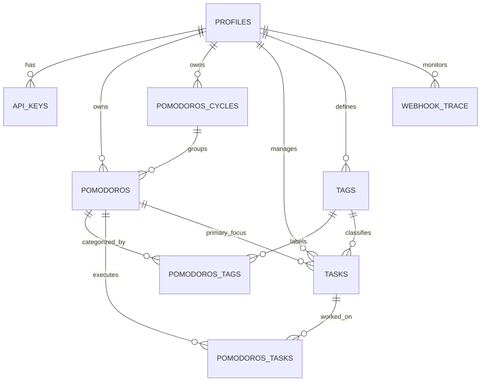

# Modelo Entidad-Relación (ERM) - yourfocus

Este documento describe la estructura de datos del proyecto **yourfocus** (anteriormente Self-Productiveness), detallando las entidades, sus atributos y las relaciones entre ellas. El diseño sigue una arquitectura modular orientada a la técnica Pomodoro y la alineación estratégica.

## Diagrama Entidad-Relación (Mermaid)

---

## 2. Diccionario de Datos

### 2.1 Entidades Core

#### `profiles`

Información de perfil de usuario extendida desde la autenticación.

- `id` (uuid, PK): ID único del usuario (Supabase Auth).
- `username` (text): Nombre de usuario único.
- `fullname` (text): Nombre completo.
- `avatar_url` (text): URL de la imagen de perfil.
- `has_password` (boolean, nullable): Indica si el usuario tiene contraseña.
- `settings` (jsonb): Preferencias personalizadas del usuario.
- `updated_at` (timestamp, nullable): Última actualización del perfil.

#### `pomodoros`

Representa una sesión individual de tiempo (Enfoque o Descanso).

- `id` (bigint, PK): ID autoincremental.
- `user_id` (uuid, FK): Referencia a `profiles`.
- `cycle` (bigint, FK): Referencia a `pomodoros_cycles`.
- `type` (enum): Tipo de sesión (`focus`, `break`, `long-break`).
- `state` (enum): Estado actual (`current`, `paused`, `finished`). Por defecto: `paused`.
- `started_at` (timestamp): Cuándo inició la sesión.
- `finished_at` (timestamp): Cuándo finalizó.
- `expected_duration` (smallint): Duración planificada en segundos (Default: 1500).
- `timelapse` (smallint): Duración real registrada en segundos (Default: 0).
- `expected_end` (timestamp): Hora proyectada de finalización.
- `toggle_timeline` (jsonb): Historial de pausas.
- `created_at` (timestamp): Fecha de creación (Default: `now()`).

#### `pomodoros_cycles`

Agrupación lógica de pomodoros para formar ciclos de trabajo.

- `id` (bigint, PK): ID único del ciclo.
- `user_id` (uuid, FK): Referencia a `profiles`.
- `state` (enum): Estado del ciclo.
- `required_tags` (text[]): Secuencia de etiquetas necesarias para completar el ciclo.
- `created_at` (timestamp): Fecha de creación.

#### `tasks`

Tareas o unidades de trabajo que el usuario desea realizar.

- `id` (uuid, PK): ID único.
- `user_id` (uuid, FK): Referencia a `profiles`.
- `title` (text): Resumen de la tarea.
- `description` (text): Detalles adicionales.
- `done` (boolean): Estado de completitud (Default: `false`).
- `done_at` (timestamp): Cuándo se marcó como completada.
- `archived` (boolean): Si la tarea está oculta (Default: `false`).
- `keep` (boolean): Indica persistencia tras completado (Default: `false`).
- `pomodoro_id` (bigint, FK): Pomodoro vinculado.
- `tag_id` (bigint, FK): Etiqueta de clasificación (referencia a `tags`).
- `created_at` (timestamp): Fecha de creación.
- `updated_at` (timestamp): Última modificación.

#### `tags`

Etiquetas globales y personalizadas para categorizar tiempo y tareas.

- `id` (int, PK): ID único.
- `user_id` (uuid, FK): Referencia a `profiles`.
- `label` (text): Nombre de la etiqueta (ej: "Trabajo", "Salud").
- `type` (text): Identificador interno (ej: "focus", "break").
- `created_at` (timestamp): Fecha de creación.

### 2.2 Relaciones (Tablas Intermedias)

#### `pomodoros_tags`

Relación N-M entre una sesión y sus categorías.

- `pomodoro` (bigint, FK): ID del pomodoro.
- `tag` (bigint, FK): ID de la etiqueta.
- `user_id` (uuid, FK): Propietario del registro.

#### `pomodoros_tasks`

Relación N-M para registrar qué tareas fueron trabajadas durante un pomodoro.

- `id` (bigint, PK): ID único de la relación.
- `pomodoro_id` (bigint, FK): ID del pomodoro.
- `task_id` (uuid, FK): ID de la tarea.
- `user_id` (uuid, FK): Propietario.
- `created_at` (timestamp): Registro de vinculación.

#### `api_keys`

Tokens de acceso personal para integraciones (n8n, APIs externas).

- `id` (uuid, PK): ID del token.
- `user_id` (uuid, FK): Referencia a `profiles`.
- `name` (text): Nombre descriptivo (ej: "n8n Home Lab").
- `is_active` (boolean): Estado del token (Default: `true`).
- `created_at` (timestamp): Fecha de emisión.

### 2.3 Entidades Operacionales

#### `webhook_trace`

Registro de ejecución de procesos asíncronos y webhooks mediante PGMQ.

- `id` (bigint, PK): ID de traza.
- `pgmq_msg_id` (bigint): Referencia al mensaje en la cola.
- `net_request_id` (bigint): ID de la petición de red (si aplica).
- `user_id` (uuid, FK): Usuario que disparó el evento.
- `processed_at` (timestamp): Marca temporal de procesamiento.

---

## 3. Enumeraciones (Enums)

| Nombre           | Valores Permitidos              | Descripción                          | Default  |
| :--------------- | :------------------------------ | :----------------------------------- | :------- |
| `pomodoro-state` | `current`, `paused`, `finished` | Ciclo de vida de una sesión/ciclo.   | `paused` |
| `pomodoro-type`  | `focus`, `break`, `long-break`  | Propósito de la inversión de tiempo. | `focus`  |

---

## 4. Lógica de Negocio en Base de Datos

El sistema delega lógica crítica al motor PostgreSQL para garantizar atomicidad y rendimiento:

### 4.1 Funciones de Automatización

- `calculate_pomodoro_timelapse_sql`: Calcula en tiempo real el `timelapse` neto restando periodos de pausa.
- `auto_finish_expired_pomodoros`: Proceso de limpieza para sesiones que excedieron su `expected_duration`.
- `carry_over_keep_tasks`: Mueve tareas marcadas como `keep: true` al siguiente bloque de tiempo automáticamente.
- `enqueue_webhook`: Sistema de encolamiento (PGMQ) para disparar eventos hacia n8n u otros servicios externos tras cambios de estado.

### 4.2 Triggers Activos

- `sync_pomodoro_expected_end`: Actualiza automáticamente la proyección de fin basada en el estado y tiempo restante.
- `set_tasks_done_at`: Garantiza que `done_at` se registre exactamente cuando `done` pasa a `true`.
- `handle_new_user`: Inicializa el `profile` y etiquetas base al detectar un nuevo registro en `auth.users`.
- `update_updated_at_column`: Boilerplate para mantener la integridad de `updated_at`.
