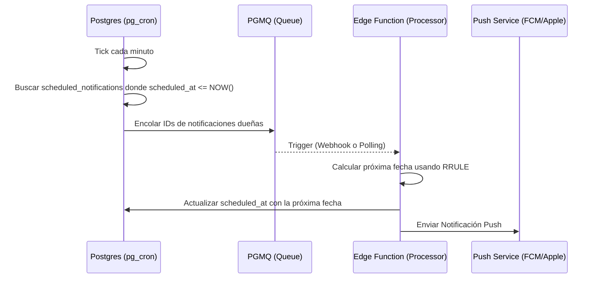

# Especificaciones: Notificaciones Programadas y Recurrentes (RRULE + PGMQ)

## 1. Descripción General

Esta feature permite programar notificaciones (recordatorios) puntuales o recurrentes utilizando el estándar **RRULE**. La arquitectura está diseñada para ser altamente escalable y mantenible dentro del ecosistema de Supabase, aprovechando `pg_cron` como despachador y `pgmq` como cola de mensajes.

## 2. Requerimientos Funcionales

- **Recurrencia RRULE**: Soporte para el estándar iCalendar (RFC 5545). Ejemplo: `FREQ=DAILY;INTERVAL=2` (cada 2 días).
- **Creación Flexible**: Por el usuario, sistema o agente de IA.
- **Plantillas de Notificaciones**: Cuentan con un esquema propio (`notification_templates`) enfocado en propiedades de un mensaje (título, cuerpo, iconos, enlaces profundos).
- **Zonas Horarias**: Almacenamiento del timezone del usuario para cálculos precisos.

---

## 3. Arquitectura del Sistema (Escalabilidad y Rendimiento)

Para asegurar el rendimiento y evitar "race conditions" o sobrecarga en la base de datos, utilizaremos un patrón de **Fan-out** con colas.

### Componentes:

1. **Postgres (Storage)**: Tablas de estado y metadatos.
2. **pg_cron (Scheduler)**: Actúa como el "latido" del sistema (cada minuto).
3. **pgmq (Message Queue)**: Desacopla el hallazgo de tareas de su ejecución.
4. **Edge Functions (Processor)**: Lógica de negocio pesada (cálculo de RRULE y envío Push).

### Diagrama de Flujo:



---

## 4. Estructura de Datos (Tablas)

### Tabla: `notification_templates`

- `id` (uuid, PK)
- `name` (text, ej. "Recordatorio Diario")
- `title` (text, ej. "¡Es hora de enfocarse!")
- `body` (text, ej. "Tienes tareas pendientes por hacer hoy.")
- `icon` (text, opcional, ej. "/favicon.ico")
- `link` (text, opcional, ej. "/dashboard")
- `created_at` (timestamp tz)

### Tabla: `scheduled_notifications`

- `id` (uuid, PK)
- `user_id` (uuid, FK)
- `template_id` (uuid, FK, opcional)
- `rrule` (text, ej: `FREQ=WEEKLY;BYDAY=MO,WE,FR`)
- `scheduled_at` (timestamp tz): **Siguiente** fecha de ejecución calculada.
- `last_executed_at` (timestamp tz): Fecha de la última vez que se envió.
- `timezone` (text): Ej: `Europe/Madrid`.
- `payload_override` (jsonb): Título/Cuerpo personalizado si no usa template.
- `status` (text): `active`, `paused`, `completed`.

---

## 5. Implementación del Despachador (pg_cron + pgmq)

El uso de `pgmq` permite que, si en un minuto hay 10,000 notificaciones que enviar, Postgres no se bloquee intentando enviarlas todas. Simplemente las mete en la cola en milisegundos.

### SQL: Encolado con pg_cron

```sql
-- Función que corre cada minuto
SELECT cron.schedule('notification-dispatcher', '* * * * *', $$
  WITH due_notifications AS (
    SELECT id
    FROM public.scheduled_notifications
    WHERE scheduled_at <= now()
      AND status = 'active'
    FOR UPDATE SKIP LOCKED -- Evita colisiones si hay múltiples schedulers
  )
  SELECT pgmq.send('notifications_queue', json_build_object('id', id))
  FROM due_notifications;
$$);
```

### Edge Function: `process-notification`

Esta función es activada por un webhook de `pgmq` o por un worker dedicado.

1. **Recibe**: `{ "id": "..." }`.
2. **Lógica**:
   - Lee la regla `RRULE` y el `timezone`.
   - Usa una librería (ej: `rrule.js`) en Deno para calcular el **siguiente** `scheduled_at` basándose en el `scheduled_at` actual.
   - Actualiza la tabla `scheduled_notifications` con el nuevo `scheduled_at`.
   - Envía la notificación push (reutilizando la infraestructura de `send-push`).

---

## 6. Ventajas de esta Arquitectura

- **Mantenibilidad**: La lógica compleja de fechas (RRULE) reside en TypeScript (Edge Function), no en SQL.
- **Escalabilidad**: `pgmq` permite procesar miles de mensajes en paralelo mediante múltiples instancias de Edge Functions si fuera necesario.
- **Resiliencia**: Si el servicio de Push falla, el mensaje puede reintentarse en la cola sin perder la programación original.
- **Rendimiento**: El índice sobre `scheduled_at` hace que la búsqueda por parte de `pg_cron` sea extremadamente eficiente.
