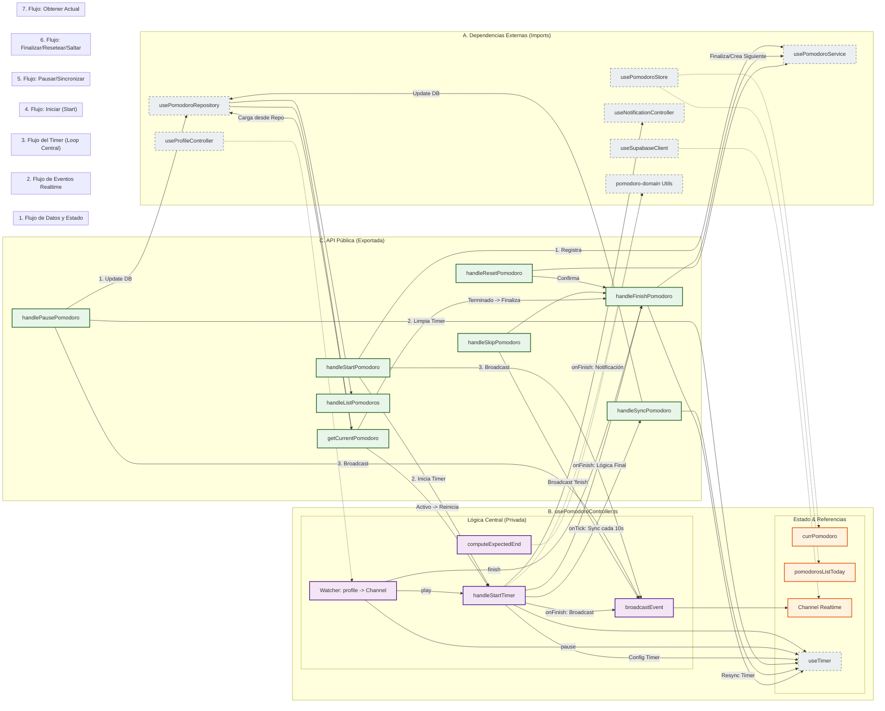

# Diagrama de Flujo: Use Pomodoro Controller

```mermaid
graph LR
    %% ESTILOS (Mantener estilos para consistencia)
    classDef module fill:#e1f5fe,stroke:#01579b,stroke-width:2px;
    classDef state fill:#fff3e0,stroke:#e65100,stroke-width:2px;
    classDef internal fill:#f3e5f5,stroke:#4a148c,stroke-width:2px;
    classDef public fill:#e8f5e9,stroke:#1b5e20,stroke-width:2px;
    classDef ext fill:#eceff1,stroke:#37474f,stroke-width:1px,stroke-dasharray: 5 5;

    %% A. DEPENDENCIAS EXTERNAS (Columna Izquierda)
    subgraph Dependencies ["A. Dependencias Externas (Imports)"]
        direction TB
        Store[usePomodoroStore]:::ext
        Repo[usePomodoroRepository]:::ext
        Service[usePomodoroService]:::ext
        Notif[useNotificationController]:::ext
        Profile[useProfileController]:::ext
        Supa[useSupabaseClient]:::ext
        Utils[pomodoro-domain Utils]:::ext
    end

    %% B. CONTROLADOR PRINCIPAL Y SU ESTADO (Columna Central)
    subgraph Controller ["B. usePomodoroController.ts"]
        direction TB
        
        subgraph Internal ["Lógica Central (Privada)"]
            direction LR
            Broadcast[broadcastEvent]:::internal
            InternalStart[handleStartTimer]:::internal
            CompExp[computeExpectedEnd]:::internal
            RealtimeWatcher[Watcher: profile -> Channel]:::internal
        end

        subgraph State ["Estado & Referencias"]
            CurrP[currPomodoro]:::state
            PList[pomodorosListToday]:::state
            Realtime[Channel Realtime]:::state
            Timer[useTimer]:::ext
        end
        
        InternalStart --> Timer
    end
    
    %% C. API PÚBLICA (Columna Derecha)
    subgraph Public ["C. API Pública (Exportada)"]
        direction TB
        Start[handleStartPomodoro]:::public
        Pause[handlePausePomodoro]:::public
        Finish[handleFinishPomodoro]:::public
        Reset[handleResetPomodoro]:::public
        Skip[handleSkipPomodoro]:::public
        Sync[handleSyncPomodoro]:::public
        GetCurr[getCurrentPomodoro]:::public
        List[handleListPomodoros]:::public
    end

    %% =========================================================
    %% CONEXIONES PRINCIPALES (Flujo entre las Columnas A, B, C)
    %% =========================================================

    subgraph DataFlow ["1. Flujo de Datos y Estado"]
        direction LR
        Store -.-> CurrP & PList
        Repo --> List & GetCurr
        Supa -.-> Realtime
        Profile -.-> RealtimeWatcher
        
        InternalStart & CompExp -.-> Utils
    end
    
    subgraph RealtimeFlow ["2. Flujo de Eventos Realtime"]
        direction LR
        RealtimeWatcher -- "play" --> InternalStart
        RealtimeWatcher -- "pause" --> Timer
        RealtimeWatcher -- "finish" --> Finish
        Broadcast --> Realtime
    end
    
    subgraph TimerLogic ["3. Flujo del Timer (Loop Central)"]
        direction LR
        InternalStart -- "Config Timer" --> Timer
        InternalStart -- "onTick: Sync cada 10s" --> Sync
        InternalStart -- "onFinish: Lógica Final" --> Finish
        InternalStart -- "onFinish: Broadcast" --> Broadcast
        InternalStart -- "onFinish: Notificación" --> Notif
    end

    subgraph APIFlow_Start ["4. Flujo: Iniciar (Start)"]
        direction LR
        Start -- "1. Registra" --> Service
        Start -- "2. Inicia Timer" --> InternalStart
        Start -- "3. Broadcast" --> Broadcast
    end

    subgraph APIFlow_Pause ["5. Flujo: Pausar/Sincronizar"]
        direction LR
        Pause -- "1. Update DB" --> Repo
        Pause -- "2. Limpia Timer" --> Timer
        Pause -- "3. Broadcast" --> Broadcast
        Sync -- "Update DB" --> Repo
        Sync -- "Resync Timer" --> Timer
    end
    
    subgraph APIFlow_Finish ["6. Flujo: Finalizar/Resetear/Saltar"]
        direction LR
        Finish -- "Finaliza/Crea Siguiente" --> Service
        Finish --> Timer
        Reset -- "Confirma" --> Finish
        Reset --> Service
        Skip --> Finish
        Skip -- "Broadcast 'finish'" --> Broadcast
    end
    
    subgraph APIFlow_GetCurrent ["7. Flujo: Obtener Actual"]
        direction LR
        GetCurr -- "Carga desde Repo" --> Repo
        GetCurr -- "Activo -> Reinicia" --> InternalStart
        GetCurr -- "Terminado -> Finaliza" --> Finish
    end
```
