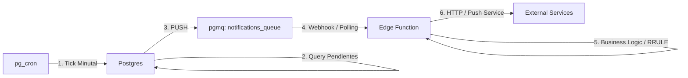

# Patrón Arquitectónico: Fan-out para Notificaciones y Webhooks

## 1. Contexto

En sistemas basados en Supabase, el envío de notificaciones o ejecución de webhooks a gran escala puede saturar los recursos de la base de datos si se realiza de forma síncrona o mediante triggers simples que invocan HTTP directamente.

## 2. Arquitectura Fan-out (pg_cron + pgmq + Edge Functions)

Este patrón permite desacoplar la **detección del evento** de la **ejecución de la tarea**, permitiendo un procesamiento asíncrono, resiliente y escalable.

### Diagrama

## 3. Ventajas del Patrón

- **Escalabilidad Horizontal**: Podemos aumentar el número de instancias de la Edge Function para procesar la cola `pgmq` sin afectar el rendimiento de la DB.
- **Tolerancia a Fallos**: Si el servicio externo (FCM, Apple, Webhook) está caído, el mensaje permanece en `pgmq` y puede reintentarse automáticamente (utilizando el _Visibility Timeout_).
- **Control de Concurrencia**: Evita que una ráfaga de 10,000 eventos bloquee las conexiones de Postgres.

## 4. Comparación con Triggers Directos

| Característica          | Trigger Directo (net.http_post) | Fan-out (pgmq)                         |
| :---------------------- | :------------------------------ | :------------------------------------- |
| **Latencia en DB**      | Alta (espera al HTTP)           | Mínima (escribe en cola local)         |
| **Reintentos**          | Complejos de implementar        | Nativos de la cola                     |
| **Visibilidad**         | Difícil de monitorear           | Inspeccionable vía SQL en pgmq         |
| **Lógica de Re-agenda** | Muy compleja en SQL             | Sencilla en TypeScript (Edge Function) |

## 5. Casos de Uso en YourFocus

- **Notificaciones Programadas**: Gestión de recordatorios con RRULE.
- **Webhooks de Terceros**: Sincronización con calendarios externos.
- **Procesamiento de Datos Pesados**: Tareas que requieren más de 1-2 segundos de ejecución.
